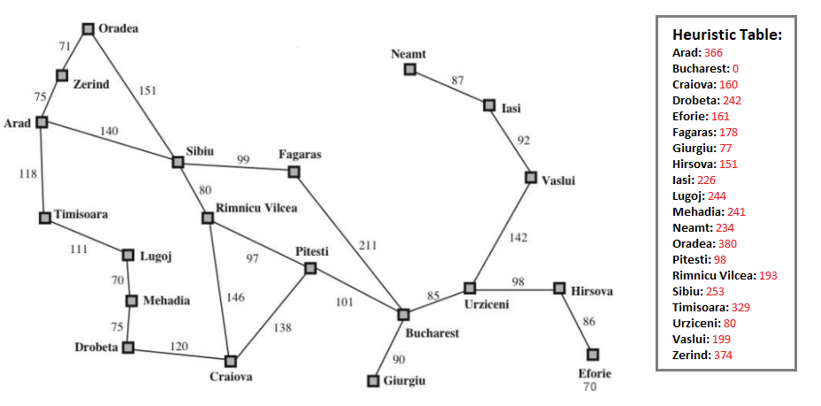

# LearningPython
Chia sẻ kinh nghiệm dùng Python (3.6), và các thuật toán được học trong môn "Các thuật toán thông minh nhân tạo và ứng dụng"
## Yêu cầu
* [Python 3.6.*](https://www.python.org/downloads/) - Phải có
## Cài đặt
* Click vào **Clone or download** -> **Download ZIP** -> giải nén .rar
* Mở **CMD**, **Shell**, **Terminal**... chạy các lệnh sau 
```
cd đường-dẫn-tới-LearningPython
python main.py
```
## Giải thích
* **main.py** - File chính của project, dùng để chạy thử
* **mymap.py** - Chứa bản đồ được sử dụng trong môn "Các thuật toán thông minh nhân tạo và ứng dụng - ĐH KHTN"
* **mymap.png** - Hình ảnh bản đồ được dùng trong môn "Các thuật toán thông minh nhân tạo và ứng dụng - ĐH KHTN"
* **modules.py** - Chứa các hàm hỗ trợ cho việc in các bước di chuyển và kết quả ra màn hình
* **bfs.py** - Chứa thuật toán Breadth-first Search
* **dfs.py** - Chứa thuật toán Deep-first Search
* **lcbfs.py** - Chứa thuật toán Least-cost Breadth-first Search
* **ucs.py** - Chứa thuật toán Uniform-cost Search
* **gbfs.py** - Chứa thuật toán Greedy Best-first Search
* **astar.py** - Chứa thuật toán A*(GBFS + UCS)

## Bản đồ


